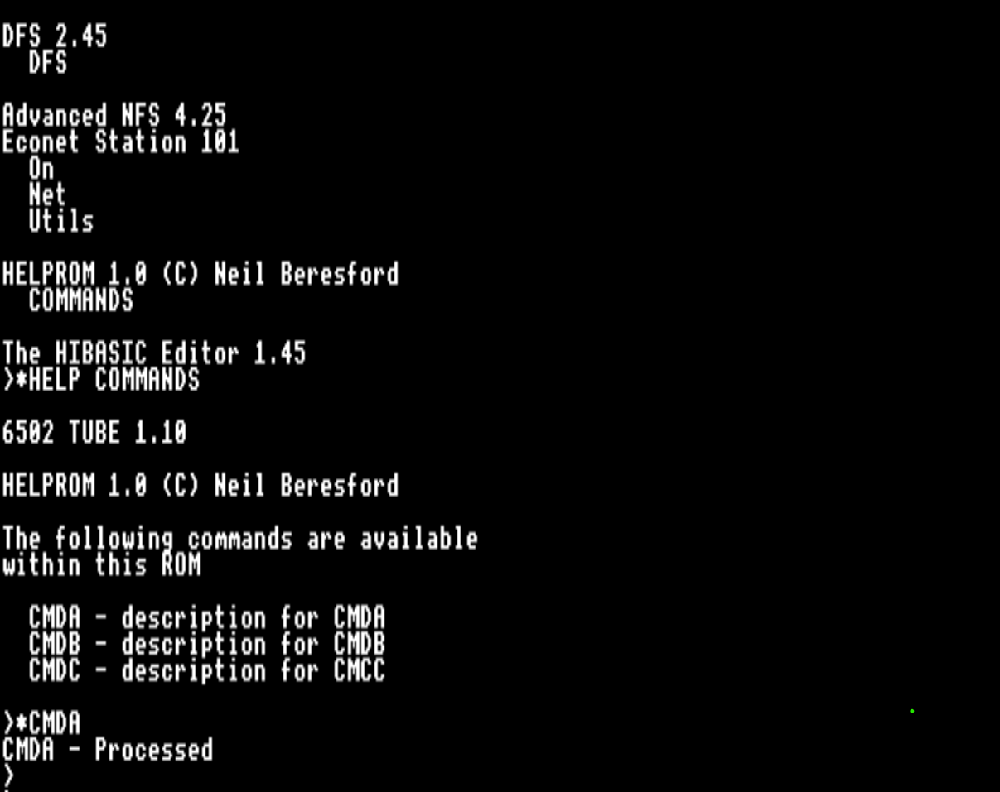

<h1>BBCMicro-Rom-Example</h1>

{{TOC}}

## What is it?
This is a small example of developing a ROM in 6502 assembler, built with BeebAsm. The ROM image has been tested on a BBC-B, BBC-B+,BBC Master (MOS 3.2 &amp; 3.5) and of course Beebem

This example ROM handles the system help service requests and also scans the name of any unrecognized commands (star commands). I have commented the source and hopefully you should be able to follow. It's not high optimized code, it has been written clearly and is to be used as a starting point.  

## Images

### Running on a BBC Master

### Very simple build process (only windows)

### High-lighting part of the source

## What do I need?

You would need prior knowledge or the will to understand the hardware architecture of the BBC Micro. This example is a very good start for any that have wanted to put their applications onto a ROM and have it available when ever the machine is powered on.

The following I would suggest installing  - 

* Beebasm - I used v1.10 -  [GITHUB link Beebasm](https://github.com/stardot/beebasm)
* Beebem - BBC Emulator - [Link Windows version](http://www.mkw.me.uk/beebem/index.html)

## Installation

Very simple  - clone the repository in the directory you require the source. Use this command

 > git clone https://github.com/MadFly-Team/BBCMicro-Rom-Example

## Build

This assumes that you have 'beebasm' directory in the system PATH, so you run it from the command line.. 

Navigate to the 'build' directory and run 'builddisk.bat'

The command line used in the batch file is

> beebasm -i SHelpROM.asm -do SHelpRom.ssd -opt 2 -v > build.log

## Run with Beebem

Once you have built the disk, run 'runBeebem.bat' in the 'build' directory.

> beebem.exe ShelpROM.ssd

This also assumes you have Beebem in the system PATH.

